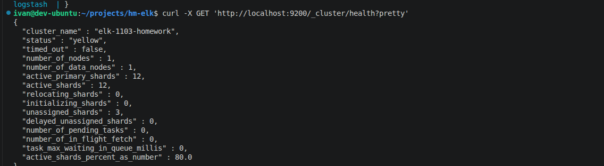
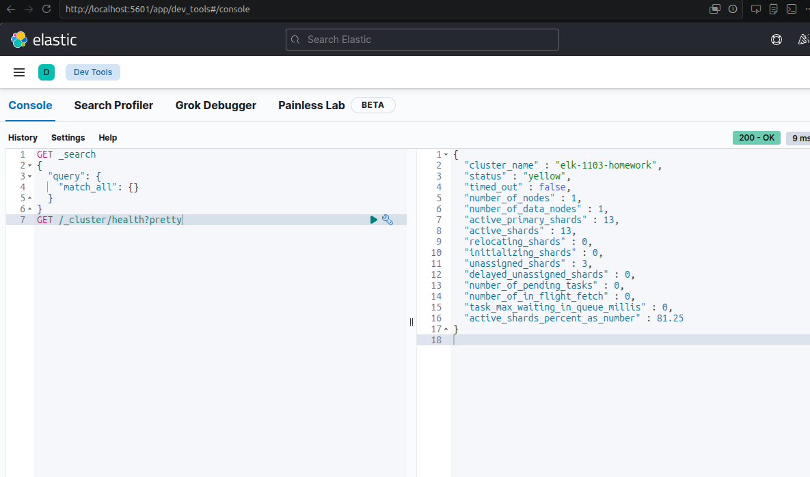
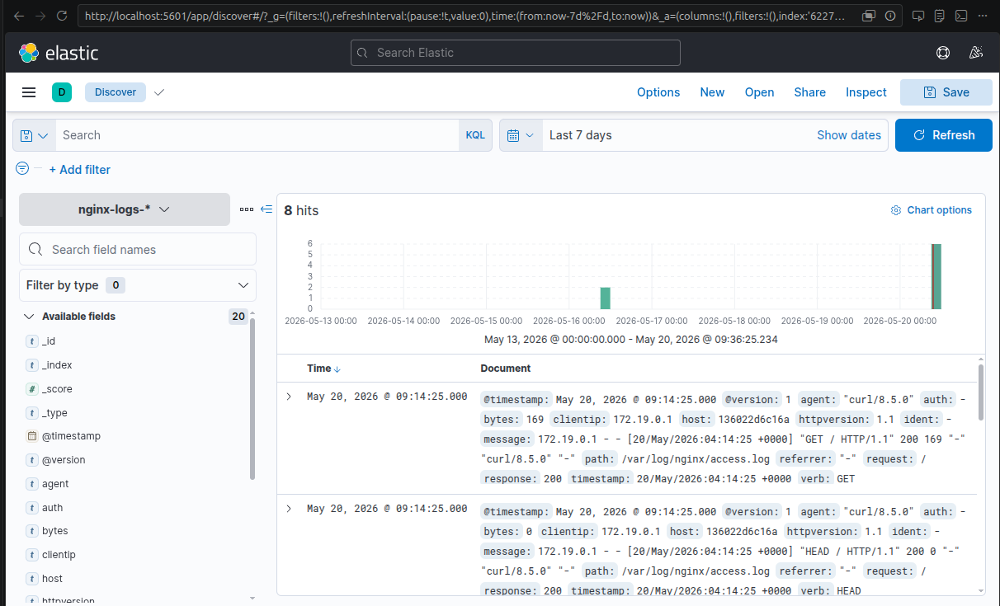
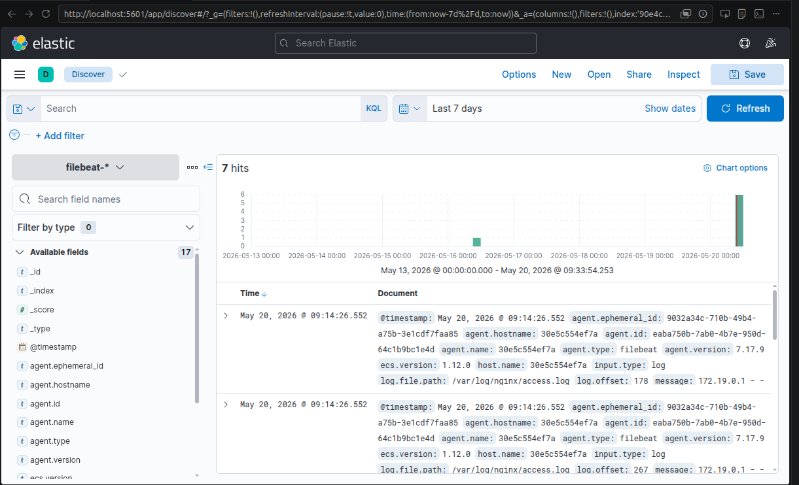
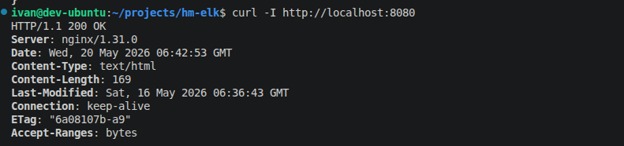

# Домашнее задание к занятию «ELK»


## Решение

### Общая конфигурация
- Стек поднят через `docker compose` в каталоге проекта.
- В `docker-compose.yaml` добавлены сервисы:
  - `elasticsearch` (7.17.9) с `cluster.name=elk-1103-homework`
  - `kibana` (7.17.9)
  - `nginx` на порту `8080`
  - `logstash` с `logstash/pipeline/logstash.conf`
  - `filebeat` с `filebeat/filebeat.yml`

### Задание 1. Elasticsearch
- Запущен Elasticsearch, `cluster_name` изменён на `elk-1103-homework`.
- Команда проверки:
  - `curl -X GET 'localhost:9200/_cluster/health?pretty'`
- Вывод:
  - `"cluster_name" : "elk-1103-homework"`


### Задание 2. Kibana
- Kibana доступна по адресу `http://localhost:5601`.
- В консоли Dev Tools выполнен запрос:
  - `GET /_cluster/health?pretty`
- Результат совпадает с кластерным состоянием Elasticsearch.


### Задание 3. Logstash
- Nginx пишет access-лог в файл `/var/log/nginx/access.log`.
- Logstash читает этот файл и отправляет данные в Elasticsearch в индекс `nginx-logs-YYYY.MM.DD`.
- Проверка индекса:
  - `nginx-logs-2026.05.16`
  

### Задание 4. Filebeat
- Filebeat настроен на чтение `/var/log/nginx/access.log` и прямую отправку в Elasticsearch.
- Индекс Filebeat:
  - `filebeat-7.17.9-2026.05.16-000001`
- Прямой лог доступа был отправлен, подтверждено через Elasticsearch.


### Проверка логов Nginx
- Запрос к Nginx через браузер/`curl`:
  - `curl -I http://localhost:8080`
- Nginx вернул `HTTP/1.1 200 OK`.
- Файл логов создан и содержит доступ:
  - `nginx/logs/access.log`


### Полезные файлы
- `docker-compose.yaml`
- `logstash/pipeline/logstash.conf`
- `filebeat/filebeat.yml`
- `nginx/conf.d/default.conf`

### Дополнительно
- В конфигурации `filebeat.yml` убран конфликтный топ-левел `service` для корректной доставки событий в Elasticsearch.
- В `docker-compose.yaml` удалено устаревшее поле `version` для совместимости с Docker Compose v5.

---

## Приложения (выводы команд)

1) Состояние кластера Elasticsearch (команда выполнена на сервере):

```
{
  "cluster_name" : "elk-1103-homework",
  "status" : "yellow",
  "timed_out" : false,
  "number_of_nodes" : 1,
  "number_of_data_nodes" : 1,
  "active_primary_shards" : 9,
  "active_shards" : 9,
  "unassigned_shards" : 1,
  "active_shards_percent_as_number" : 90.0
}
```

2) Проверка доступности Nginx (curl):

```
HTTP/1.1 200 OK
Server: nginx/1.31.0
Content-Type: text/html
Content-Length: 169
ETag: "6a08107b-a9"
```

3) Список индексов в Elasticsearch (включая `nginx-logs` и `filebeat`):

```
green  open   .kibana_7.17.9_001              7QKsJekBQJOnuZS5O6Q98A   1   0     10            0      2.3mb
yellow open   nginx-logs-2026.05.16           -C4qBjQSR8mSFrWJMON_cg   1   1      1            0     12.6kb
yellow open   filebeat-7.17.9-2026.05.16-000001 tYclrt5fQFKNxe3dSKKkFg   1   1      0            0     226b
```

4) Количество документов в индексах:

```
filebeat-7.17.9: { "count": 1 }
nginx-logs-2026.05.16: { "count": 2 }
```
